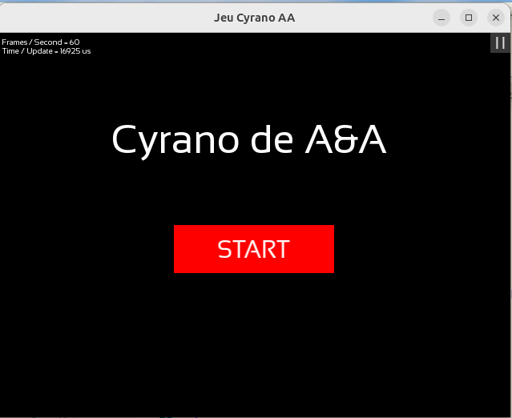
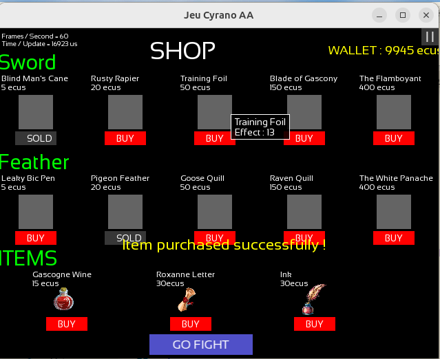
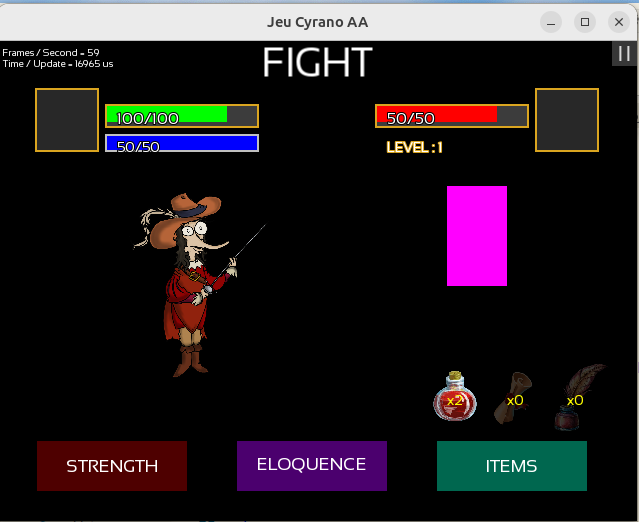
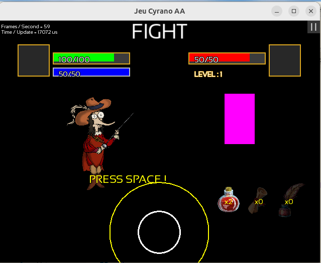
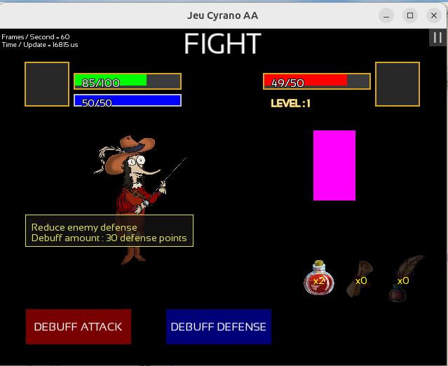
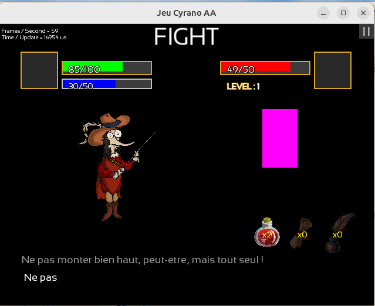
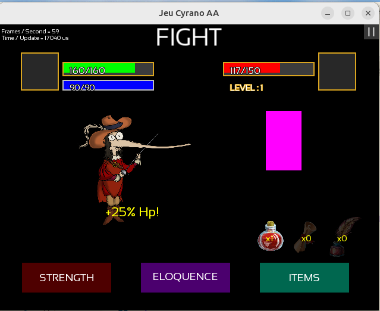
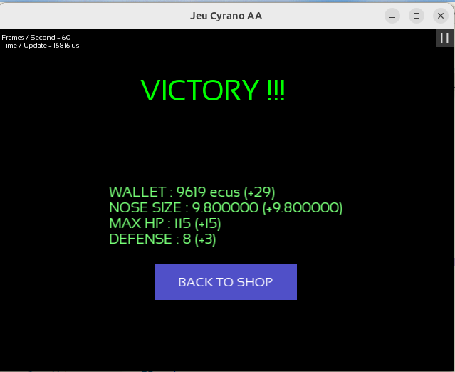
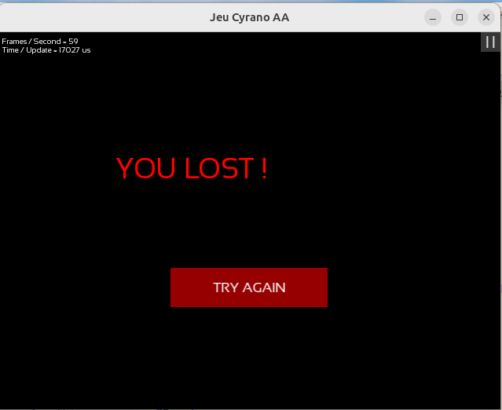
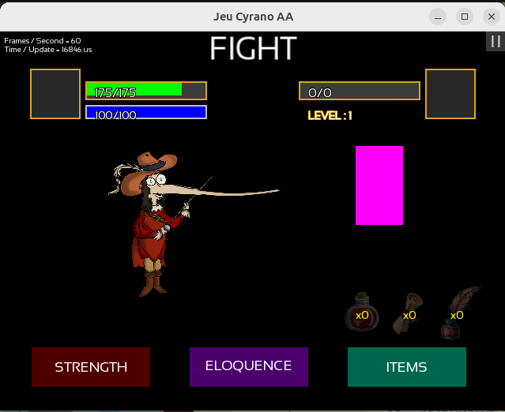

# Micro-projet, réalisé en binôme (charge totale de travail estimée à xxx heures)

# CyraNose- Le Jeu

## Description du Jeu
**CyraNose** est un jeu de rôle tactique inspiré de la vie et de l'œuvre de *Cyrano de Bergerac*. Oubliez les combats de RPG classiques où l'épée est la seule solution : ici, le verbe est tout aussi tranchant que l'acier. Vous incarnez un fan de Cyrano et devez terrasser divers adversaires en combinant passes d'armes et joutes verbales. Après chaque victoire, votre nez s'allonge de plus en plus et vous ressemblez ainsi davantage à votre idole !

Le système de combat repose sur un "Chifoumi" tactique où il faut affaiblir les faiblesses psychologiques ou physiques de vos ennemis grâce à des mécaniques d'escrime verbale (Éloquence/Debuff) et de maîtrise de l'épée (Force), tout en gérant votre jauge d'inspiration. Vous pouvez également acheter des items qui boostent vos capacités.

### Aperçu du jeu
*Les ennemis sont encore représentés par un rectangle rose. Patience, ils apparaitront dans une prochaine mise à jour.*
















---

## Instructions pour Jouer

Le jeu se joue principalement à la souris et au clavier.

### Phases de Combat (FIGHT)
* **STRENGTH (Attaque physique) :** Déclenche un QTE où un cercle se referme. Appuyez sur **ESPACE** lorsque le cercle en mouvement est le plus proche possible du cercle cible pour infliger un maximum de dégâts.
* **ELOQUENCE (Attaque verbale) :** Permet d'affaiblir l'adversaire (Attaque ou Défense). Vous devrez compléter par écrit une tirade affichée à l'écran en tapant les lettres au clavier.
* **ITEMS (Inventaire) :** Vous pouvez consommer un objet par tour (soin, boost de force, boost d'éloquence) en cliquant sur son icône en haut à droite de l'écran de combat. 
* **Touche ÉCHAP (ESC) :** Permet d'annuler une action en cours de sélection (avant de lancer la QTE).

### Gestion (SHOP et Menus)
* **Achat :** Cliquez sur les boutons **BUY** sous les armes et objets pour dépenser les écus gagnés lors de vos victoires.
* **Pause :** Vous pouvez mettre le jeu en pause à tout moment en cliquant sur le bouton `| |` en haut à droite de la fenêtre.

---

## Instructions de Génération et Compilation

Ce projet utilise **CMake** pour générer les fichiers de build (Makefiles, projets Visual Studio, etc.) et la bibliothèque **SFML** pour la gestion graphique et sonore.

Pour configurer et compiler le projet, référez-vous au support officiel :
[Documentation Outils CSC4526 (CMake)](https://www-inf.telecom-sudparis.eu/COURS/CSC4526/new_site/Supports/Documents/OutilsCSC4526/outilsCSC4526.html#cmake)

### Prérequis

Avant de compiler, assurez-vous d'avoir installé sur votre machine :
* Un compilateur C++ récent (supportant au moins **C++17**).
* **CMake** (version 3.15 minimum recommandée).
* La bibliothèque **SFML** (version 3.x).
* La bibliothèque **PugiXML**.

### Étapes rapides (Ligne de commande)

1. Ouvrez votre terminal, placez-vous dans le dossier racine du projet (là où se trouve le fichier `CMakeLists.txt`) et créez un dossier de compilation :
   ```bash
   mkdir build
   cd build
   ```

2. Générez les fichiers de configuration via CMake :
   ```bash
   cmake ..
   ```

3. Lancez la compilation du projet :
   ```bash
   cmake --build .
   ```

4. Une fois la compilation terminée, lancez l'exécutable généré. 
   *(Note : Assurez-vous que le dossier de ressources `res/` se trouve bien dans le répertoire depuis lequel vous lancez le jeu, afin que les images et polices chargent correctement).*

   **Sur Linux / macOS :**
   ```bash
   ./main
   ```

   **Sur Windows (Powershell/CMD) :**
   ```cmd
   .\Debug\main.exe
   ```
